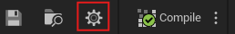
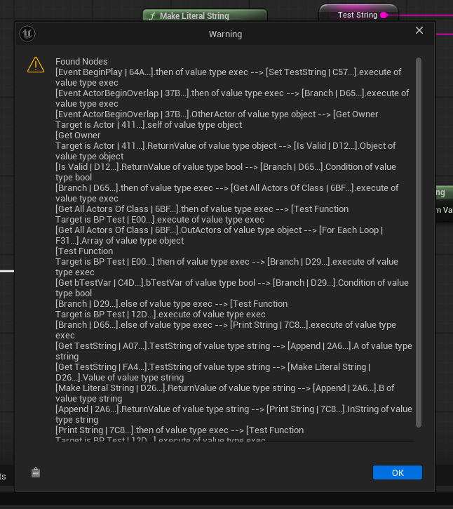

# Blueprint Reader

Blueprint Reader is an Unreal Engine plugin for the blueprint editor, including assets types like Animation Blueprint, which reads the node connections, either from selected nodes or by reading all event nodes in a blueprint, and returns a text explanation of them. This explanation is constructed in a way that AI like ChatGPT and Claude can read and understand without needing further assistance.

This plugin is meant to help you understand errors or clarify confusing Blueprint logic faster with the help of AI.

Blueprint Reader has been tested for Unreal Engine 5.5 up to 5.8

## Installation

1. Download release ZIP file
2. Extract it in your projects `Plugins\` folder.
3. Open your Unreal project and enable the plugin via Edit -> Plugins.
4. If asked, restart editor.

## Using Blueprint Reader

To use Blueprint reader simply open a Blueprint asset and you'll find a gear icon left of the compile button.

You will then be met with a pop-up window which gives you three buttons to select from.

This buttons change how the plugin reads your blueprint, the options are:

1. Read selected node (Reads from singular selected node)
2. Read selected nodes (Reads from multiple selected nodes, **EXPERIMENTAL: Does not guarantee a full read**)
3. Read all Event Nodes (Reads from all event nodes)

### Output example

After selecting an option, the plugin will return this warning window:

**You can use the bottom left "Clipboard" icon to copy the whole text.**

## Limitations

Blueprint reader does **not** read any values from Node pins, or variables during its read. This is being worked on but no ETA can be given on when this feature will be added.
